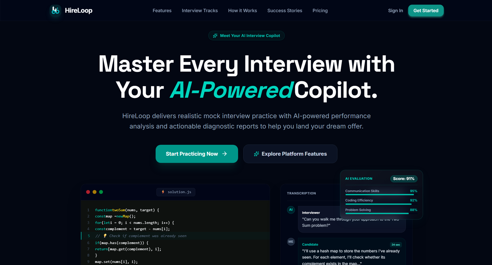

  # 🚀 HireLoop

## AI-Powered Interview Preparation Platform

**Practice. Perform. Improve.**

 

---

## 📌 About

**HireLoop** is an AI-powered interview preparation platform designed to simulate real-world interview experiences.

It allows candidates to configure and practice different types of interviews while tracking their interview history and progress through a modern, responsive interface.

> 🚧 **HireLoop is an ongoing project and is actively being developed.**

---

## ✨ Features Completed So Far

### 🎨 Beautiful Landing Page

A modern, polished landing page designed to introduce HireLoop and its core capabilities.

### 📱 Mobile Responsive

Fully responsive interface designed to provide a smooth experience across desktop, tablet, and mobile devices.

### 🔐 Google OAuth Login

Secure and convenient authentication using Google OAuth.

### 💳 Stripe Payment Gateway

Integrated Stripe Checkout for secure payment processing.

### 🪙 Credit-Based System

A credit-based system for managing interview usage and purchases.

### 🧾 Downloadable Payment Receipt

Users can download their payment receipts as PDF documents.

### ⚙️ Interview Configuration

Customize interviews based on the desired interview type and configuration before starting.

### 🎙️ AI Interview

Interactive AI-powered interview experience designed to simulate realistic interview sessions.

### 📚 Interview History

View and manage previously conducted interviews from a centralized interview history section.

---

## 🛠️ Tech Stack

| Category       | Technologies                     |
| -------------- | -------------------------------- |
| Frontend       | React.js, JavaScript, TypeScript |
| Framework      | Next.js                          |
| Styling        | Tailwind CSS                     |
| Database       | PostgreSQL, Neon                 |
| ORM            | Prisma                           |
| Authentication | Google OAuth                     |
| Payments       | Stripe                           |
| Storage        | Supabase                         |

---

## 🔮 Upcoming Features

HireLoop is continuously evolving, with several major features currently planned:

### 💻 Coding Interview Room

A dedicated coding interview environment with an integrated code editor for solving programming problems during AI-powered interviews.

### 🤖 AI-Generated Summary & Analysis

AI-generated interview summaries and detailed performance analysis based on the candidate's interview responses.

### 📊 Dashboard

A personalized dashboard providing an overview of interview performance, credits, activity, and progress.

### 👤 Profile & Settings

Dedicated profile and settings pages for managing user information and application preferences.

---

## 🎯 Vision

HireLoop aims to become a complete AI-powered interview preparation platform that helps candidates **practice realistically, understand their weaknesses, track their progress, and become more confident for real interviews.**

> **Prepare smarter. Practice realistically. Get hired. 🚀**

---

## 👨‍💻 Developer

### Built with ❤️ by **Ujjawal Gupta**

**Full-Stack Developer & Creator of HireLoop**

---

### ⭐ If you find HireLoop interesting, consider giving the repository a star!

